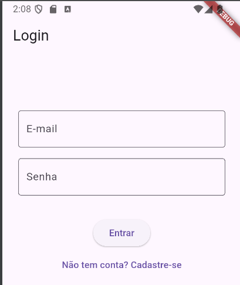
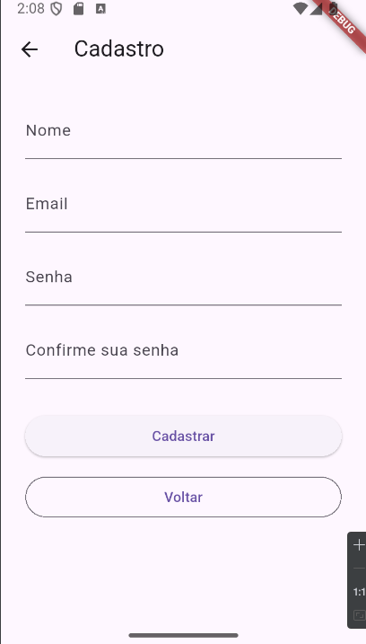
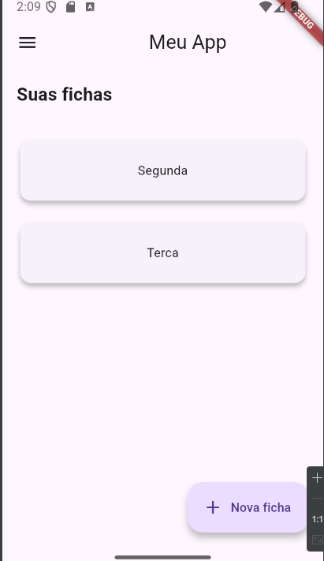
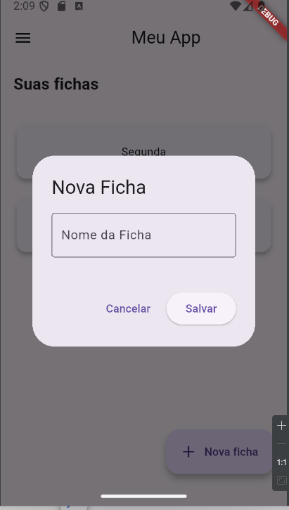
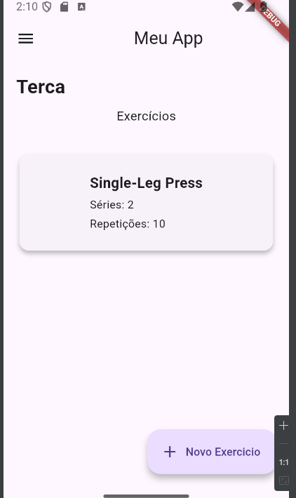
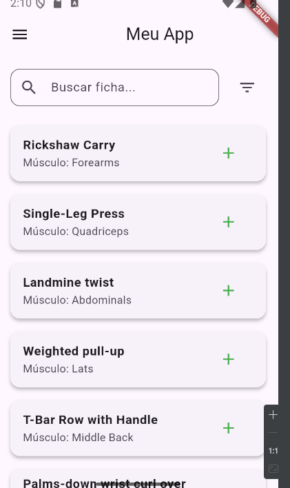
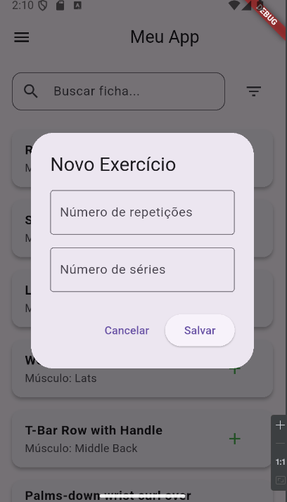

# Fitness App - Gerenciador de Fichas de Exercícios

Este projeto foi desenvolvido utilizando o **Flutter**, um framework criado pelo Google para o desenvolvimento de aplicações **multiplataforma** com uma única base de código.

Embora o Flutter permita a criação de apps para web, desktop e iOS, o foco deste projeto foi a plataforma **Android**, onde o aplicativo foi projetado, implementado e testado.

---

## Descrição do Projeto

O tema do projeto é **fitness**, oferecendo ao usuário a possibilidade de **criar fichas de treino personalizadas**, com exercícios específicos selecionados a partir de uma base de dados completa.

---

## Estrutura do Aplicativo

O sistema é composto por três componentes principais:

### Usuário
- Cadastro de novo usuário
- Login com verificação de credenciais
- Gerenciamento de sessão (sessão ativa, logout automático)

  
  

---

### Fichas
- Criação de fichas de treino
- Adição e remoção de exercícios nas fichas
- Definição de séries e repetições para cada exercício

  
  

---

### Exercícios
- Recuperação de exercícios a partir de um **dataset** organizado por grupo muscular, nome e tipo
- Busca e seleção de exercícios
- Visualização detalhada dos exercícios

  
  
  

---

## Testes Automatizados

Os testes foram implementados utilizando a biblioteca oficial do Flutter chamada [`flutter_test`](https://api.flutter.dev/flutter/flutter_test/flutter_test-library.html).

Essa biblioteca permite criar **testes unitários**, **de widget** e **de integração** com ferramentas poderosas para garantir a qualidade do código.

###  Principais recursos usados:
- `test()` e `group()` para agrupar e organizar testes unitários
- `expect()` com **matchers** para validar comportamentos
- `setUp()` e `tearDown()` para controle do ciclo de vida dos testes
- `testWidgets()` para testes em interfaces Flutter

### Testes Unitários:

- **Gerenciamento de sessão**:
  - Validação do comportamento de login, logout e persistência do usuário autenticado

- **Validação de formulário**:
  - Verificações dos campos de cadastro (nome, email, senha)

- **Relacionamentos entre entidades**:
  - Garantia de que:
    - fichas estejam associadas a usuários;
    - exercícios estejam corretamente vinculados às fichas;
    - as operações de adição, edição e exclusão funcionem corretamente.
